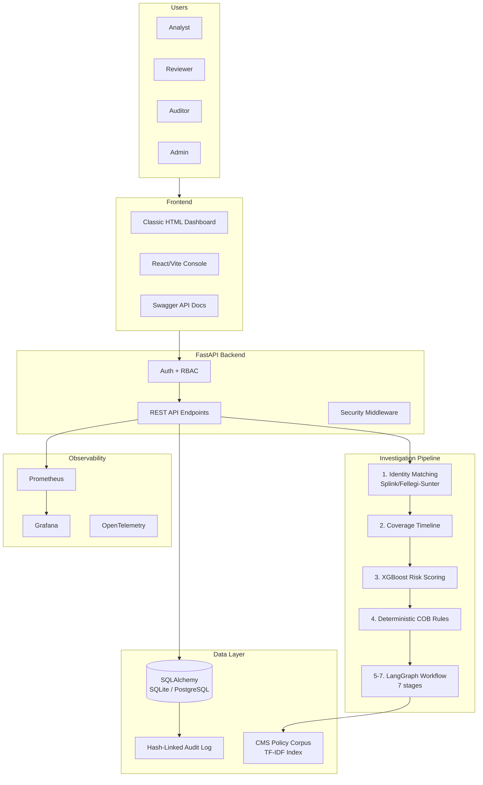

# 🛡️ ClaimArmor AI — Capstone Study Guide

> **What to say in one sentence:** "ClaimArmor AI is a pre-payment Coordination of Benefits auditing system that uses identity matching, ML risk scoring, deterministic rules, policy retrieval, and a controlled LangGraph agent workflow to catch overpayment leakage before claims are paid — with a human always in the loop."

---

## 📋 Table of Contents

1. [The Problem You're Solving](#1-the-problem-youre-solving)
2. [System Architecture (Big Picture)](#2-system-architecture-big-picture)
3. [Tech Stack](#3-tech-stack)
4. [The 7-Stage Investigation Pipeline](#4-the-7-stage-investigation-pipeline)
5. [Each Component Deep-Dive](#5-each-component-deep-dive)
6. [Security & RBAC](#6-security--rbac)
7. [ML Model Details](#7-ml-model-details)
8. [Evaluation Results (Know These Numbers!)](#8-evaluation-results-know-these-numbers)
9. [Key Design Decisions (Why Questions)](#9-key-design-decisions-why-questions)
10. [Limitations (Be Ready to Acknowledge)](#10-limitations-be-ready-to-acknowledge)
11. [Demo Script Cheat Sheet](#11-demo-script-cheat-sheet)
12. [Likely Viva Questions & Answers](#12-likely-viva-questions--answers)
13. [Key Code Files Quick Reference](#13-key-code-files-quick-reference)

---

## 1. The Problem You're Solving

### What is Coordination of Benefits (COB)?
When a person has **multiple insurance coverages** (e.g., employer plan + Medicare, or employer plan + auto insurance), there's a **legal order** for which payer pays first (primary) and which pays second (secondary). 

### The Problem: Overpayment Leakage
If the wrong payer is billed first, the result is **overpayment leakage** — money that shouldn't have been paid. In the U.S. healthcare system, this costs **billions annually**.

### What ClaimArmor Does
It sits **before payment** (pre-payment) and:
1. Identifies the member across systems
2. Checks their active coverages on the service date
3. Scores risk of overpayment using ML
4. Applies deterministic COB rules
5. Retrieves relevant CMS policy evidence
6. Runs a controlled agent workflow for reasoning
7. Routes the claim to: `CLEAR` | `HOLD` | `HUMAN_REVIEW` | `UNDETERMINED`

> [!IMPORTANT]
> **The LLM can NEVER release or deny payment.** It only proposes analysis. Deterministic code owns the final route and can only accept or escalate to human review.

---

## 2. System Architecture (Big Picture)



### The Four Docker Services
| Service | Image | Port | Purpose |
|---|---|---|---|
| `claimarmor` | Custom Python 3.11 | `:8000` | FastAPI application |
| `postgres` | `pgvector/pgvector:pg16` | Internal | PostgreSQL with vector support |
| `prometheus` | `prom/prometheus:v2.55.1` | `:9090` | Metrics collection |
| `grafana` | `grafana/grafana:11.4.0` | `:3000` | Metrics dashboards |

---

## 3. Tech Stack

| Layer | Technology | Why |
|---|---|---|
| **API Framework** | FastAPI | Async support, auto-generated docs, type validation |
| **Data Validation** | Pydantic v2 | Runtime type checking, serialization |
| **Database** | SQLAlchemy 2.0 (SQLite/PostgreSQL) | Portable ORM, dual-backend support |
| **Identity Matching** | Splink 4 + DuckDB | Probabilistic record linkage (Fellegi-Sunter) |
| **ML Model** | XGBoost (calibrated) | Gradient boosting for risk scoring |
| **ML Calibration** | scikit-learn `CalibratedClassifierCV` | 3-fold sigmoid calibration |
| **Agent Workflow** | LangGraph | Stateful graph-based agent orchestration |
| **Policy Retrieval** | TF-IDF + cosine similarity | Keyword retrieval from curated CMS corpus |
| **LLM Providers** | Gemini / OpenAI / OpenRouter | Optional enhancement (always offline fallback) |
| **Auth** | HMAC-signed bearer tokens + PBKDF2 | Stateless authentication |
| **Frontend** | React + Vite | Reviewer console |
| **Monitoring** | Prometheus + Grafana + OpenTelemetry | Metrics, traces |
| **PDF Parsing** | PyPDF | Policy document ingestion |

---

## 4. The 7-Stage Investigation Pipeline

This is the **core of your project** — a LangGraph `StateGraph` with 7 sequential nodes:

```
START → identity → coverage → research → reason → verify → financial → explain → END
```

### What Each Stage Does

| # | Stage | Node Function | What It Does |
|---|---|---|---|
| 1 | **Identity** | `identity_node` | Records member match result (ID, confidence, method) |
| 2 | **Coverage** | `coverage_node` | Summarizes active coverages on service date |
| 3 | **Research** | `research_node` | Retrieves CMS policy evidence + optional LLM policy analysis |
| 4 | **Reasoning** | `reasoning_node` | Applies deterministic rules to propose route + optional LLM primacy proposal |
| 5 | **Verification** | `verify_node` | Independent critic checks for contradictions + optional LLM critique |
| 6 | **Financial** | `financial_node` | Calculates amount at risk and net review value |
| 7 | **Explanation** | `explanation_node` | Generates human-readable explanation + optional LLM enhancement |

### The State Object (`InvestigationState`)
A TypedDict that flows through all nodes containing: `claim`, `match`, `timeline`, `risk`, `rules`, `trace`, `evidence`, `route`, `payer`, `confidence`, `contradictions`, `financial`, `explanation`.

### Investigation Result Schema
```python
class InvestigationResult(BaseModel):
    claim_id: str
    member_match: dict           # Identity resolution result
    coverage_timeline: list      # All coverages (active + inactive)
    risk: dict                   # ML probability + band + factors
    rules: list                  # Triggered COB rules
    evidence: list               # Retrieved policy documents
    agent_trace: list            # Full 7-stage trace
    recommended_primary_payer: str | None
    route: DecisionRoute         # CLEAR / HOLD / HUMAN_REVIEW / UNDETERMINED
    confidence: float            # 0 to 1
    financial_impact: dict       # Amount at risk + review cost
    explanation: str             # Human-readable summary
    limitations: list[str]       # Transparency disclosures
```

---

## 5. Each Component Deep-Dive

### 5A. Identity Matching (`matching.py`)

**Two methods with automatic fallback:**

1. **Splink/Fellegi-Sunter (Primary)** — Probabilistic record linkage
   - Uses: name comparison, DOB comparison, email, phone, member ID
   - Blocking rules: match on member_id, dob, email, phone, or name
   - Returns `match_probability` per candidate

2. **Weighted Fallback** — When Splink unavailable
   - Weights: Name (38%) + DOB (30%) + ID (20%) + Email (7%) + Phone (5%)
   - Normalizes by available weight (adjusts if fields are missing)

**Match Status:**
- `confidence >= 0.85` → `MATCHED`
- `confidence < 0.85` → `REVIEW` (escalates to human)

### 5B. Coverage Timeline (`matching.py` → `active_coverages`)
- Checks each coverage's `start` and `end` dates against the `service_date`
- Flags each as `active_on_service_date: true/false`
- Returns all coverages (not just active ones) for full visibility

### 5C. Risk Scoring (`risk.py`)

**Trained model path:**
- XGBoost → `CalibratedClassifierCV` (3-fold sigmoid)
- 13 features including: log claim amount, coverage count, Medicare/employer/auto flags, accident flag, age, match confidence, coverage overlap

**Transparent baseline fallback** (when no trained model):
- Starts at 0.08 base
- +0.32 for multiple coverages
- +0.28 for accident-related
- +0.18 for amounts ≥ $25K
- +0.12 for Medicare
- +0.12 for low identity confidence

**Risk bands:** `HIGH` (≥0.70) | `MEDIUM` (≥0.35) | `LOW` (<0.35)

### 5D. Deterministic COB Rules (`rules.py`)

Four rules — **these are AUTHORITATIVE** (override any LLM):

| Rule ID | Condition | Outcome | Logic |
|---|---|---|---|
| `COB-SINGLE-001` | Only 1 active coverage | `CLEAR` | No coordination needed |
| `COB-ACCIDENT-001` | Accident + active AUTO coverage | `HOLD` | Auto payer may be primary |
| `MSP-DUAL-001` | Medicare + Employer overlap | `REVIEW` | Needs employment facts |
| `COB-NO-COVERAGE-001` | No active coverage | `UNDETERMINED` | Can't determine payer |

### 5E. Policy Retrieval (`policy.py`)

- **Corpus:** Curated CMS MSP (Medicare Secondary Payer) chunks in `data/policies/cms_msp_chunks.json`
- **Method:** TF-IDF with bigrams + cosine similarity
- **Domain expansions:** "auto" → "accident liability no-fault", etc.
- **Security:** Trusted source prefixes (cms.gov, ecfr.gov, medicare.gov only), prompt injection detection
- **Evaluation:** 5 benchmark queries, Hit@4 = 100%, MRR = 80%

### 5F. LLM Integration (`llm.py`)

**Four provider stages** (each with offline fallback):
1. **Policy Analyst Agent** — Identifies applicable policies
2. **Primacy Reasoning Agent** — Proposes payer order  
3. **Independent Verification Critic** — Challenges the decision
4. **Explanation Agent** — Generates human-readable summary

**Key safety design:**
- Providers: Gemini, OpenAI, OpenRouter (or offline)
- All LLM output is treated as **untrusted evidence**
- JSON responses are parsed with fallback handling
- System prompt explicitly forbids payment authorization
- Deterministic code always has final authority

### 5G. Audit Trail (`db.py`)

**Hash-linked event chain** (blockchain-like):
```
event_hash = SHA256(claim_id | event_type | payload | previous_hash | timestamp)
```
- First event's `previous_hash` = `"GENESIS"`
- Each subsequent event chains to the previous
- `verify_audit_chain()` recomputes and validates the entire chain
- Tamper-evident: any modification breaks the chain

---

## 6. Security & RBAC

### Authentication
- PBKDF2-SHA256 with 180,000 iterations + per-user salt
- HMAC-signed bearer tokens (Base64 payload + SHA256 signature)
- 8-hour token lifetime
- Rate limiting: 10 login attempts per IP per minute

### Role-Based Access Control

| Capability | Analyst | Reviewer | Auditor | Admin |
|---|:---:|:---:|:---:|:---:|
| View claims & metrics | ✅ | ✅ | ✅ | ✅ |
| Create/upload claims | ✅ | ❌ | ❌ | ✅ |
| Run investigation | ✅ | ✅ | ❌ | ✅ |
| Human review/writeback | ❌ | ✅ | ❌ | ✅ |
| View audit evidence | ❌ | ✅ | ✅ | ✅ |

### Security Headers (set on every response)
- `X-Content-Type-Options: nosniff`
- `X-Frame-Options: DENY`
- `Referrer-Policy: no-referrer`
- `Content-Security-Policy` (customized per path)
- `Cache-Control: no-store` (on API responses)
- `X-Request-ID` for traceability

### Demo Credentials

| Role | Username | Password |
|---|---|---|
| Analyst | `analyst` | `Analyst123!` |
| Reviewer | `reviewer` | `Review123!` |
| Auditor | `auditor` | `Audit123!` |
| Admin | `admin` | `Admin123!` |

---

## 7. ML Model Details

### Model Card Summary
- **Name:** `overpayment-risk-v2-calibrated`
- **Algorithm:** XGBoost (fallback: HistGradientBoosting)
- **Calibration:** 3-fold sigmoid (CalibratedClassifierCV)
- **Training data:** 3,000 synthetic claims, seed 42
- **Split:** 78/22 stratified train/test
- **Scenario families:** Single coverage, Medicare+Employer overlap, accident/auto, inactive secondary, incorrect submitted payer, ambiguous identity

### 13 Features
```
claim_amount_log, active_coverage_count, has_medicare, has_employer, has_auto,
accident_related, age_on_service, match_confidence, missing_member_id,
submitted_is_employer, submitted_is_medicare, submitted_is_auto, coverage_overlap
```

### XGBoost Hyperparameters
- `n_estimators=220`, `max_depth=4`, `learning_rate=0.055`
- `subsample=0.85`, `colsample_bytree=0.9`
- `eval_metric=logloss`

> [!NOTE]
> No protected demographic characteristic is used directly. Age is included because Medicare eligibility is age-dependent — but its fairness must be reviewed before any real deployment.

---

## 8. Evaluation Results (Know These Numbers!)

### Comparative Approach Results

| Approach | Precision | Recall | F1 | PR-AUC | Value Recall | Review Rate |
|---|---:|---:|---:|---:|---:|---:|
| **Rules only** | 72.17% | 96.96% | 82.75% | 71.03% | 98.28% | 46.82% |
| **ML only** | 82.71% | 76.96% | 79.73% | 90.22% | 83.70% | 32.42% |
| **Hybrid (rules + ML + review gate)** | 74.64% | 90.87% | 81.96% | 87.62% | 93.34% | 42.42% |

### How to Explain the Trade-off
> "Rules catch almost everything (96.96% recall) but flag too many claims for review (46.82%). ML is more precise (82.71%) but misses more leakage (76.96% recall). The hybrid system balances both — it catches 93.34% of overpayment value while reviewing fewer claims than rules-only."

### Retrieval Evaluation
- **5 benchmark queries** against the CMS policy corpus
- **Hit@4:** 100% (all expected policies found in top-4)
- **MRR:** 80% (mean reciprocal rank)

### Financial Evaluation Defaults
- $35 review cost per flagged claim
- $75 delay cost per false positive
- $0.20 processing cost per evaluated claim

---

## 9. Key Design Decisions (Why Questions)

### "Why not let the LLM make the decision?"
> **Safety.** Healthcare claims involve real money and real people. The LLM can propose, analyze, and explain — but deterministic code controls the final routing. This prevents hallucination-driven payment errors.

### "Why a 7-stage pipeline instead of a single LLM call?"
> **Observability and governance.** Each stage produces a traceable output. If something goes wrong, you can see exactly which stage produced which result. It also means you can run entirely offline without any LLM.

### "Why Splink/Fellegi-Sunter for identity matching?"
> **Industry standard.** Probabilistic record linkage handles real-world data quality issues (typos, missing fields, different formats) better than exact matching. Splink implements the Fellegi-Sunter model which is well-established in healthcare data matching.

### "Why XGBoost with calibration?"
> **Calibrated probabilities matter.** A raw classifier score of 0.7 doesn't mean "70% likely overpayment." Sigmoid calibration (CalibratedClassifierCV) maps scores to actual probabilities, which is critical for risk-based routing thresholds.

### "Why hash-linked audit events?"
> **Tamper evidence.** Like a simplified blockchain, each event's hash depends on the previous event. If anyone modifies an audit record, the chain breaks and `verify_audit_chain()` detects it. This is important for healthcare compliance.

### "Why both SQLite and PostgreSQL?"
> **Portability to production.** SQLite works for demos with zero setup. PostgreSQL with pgvector is production-ready and supports vector-based retrieval. SQLAlchemy abstracts the difference — same code, swap one environment variable.

### "Why synthetic data?"
> **Compliance.** Real health claims data is PHI (Protected Health Information) under HIPAA. Using synthetic data means the project can be developed, demonstrated, and shared without any privacy risk.

---

## 10. Limitations (Be Ready to Acknowledge)

1. All data is **synthetic** — performance doesn't establish real-world accuracy
2. CMS policy corpus is a **curated subset**, not a complete legal corpus
3. COB rules are **representative demonstrations**, not legal advice
4. The LLM is **optional** and cannot authorize payment/denial
5. Default security is **demo-grade** (seeded credentials, browser tokens)
6. No HIPAA, SOC 2, or penetration-test certification
7. ROI figures are **user-controlled scenarios**, not guaranteed savings
8. EDI format is **simplified**, not certified ANSI X12 837
9. Fairness analysis and drift monitoring are **future work**

---

## 11. Demo Script Cheat Sheet

### The 3 Seeded Claims (Know These Cold!)

| Claim ID | Member | Scenario | Expected Route |
|---|---|---|---|
| `CLM-SAFE-001` | Rohan Kapoor | Low-risk, single employer coverage, $1,250 | **CLEAR** ✅ |
| `CLM-HOLD-001` | Rohan "Kappor" (typo!) | Accident-related, auto coverage active, $20K, no member_id | **HOLD** 🛑 |
| `CLM-REVIEW-001` | Maya Iyer | Employer + Medicare overlap, $50K, age 65 | **HUMAN_REVIEW** ⚠️ |

### Why CLM-HOLD-001 is Interesting
- Member name has a **deliberate typo** ("Kappor" vs "Kapoor") — tests identity matching
- **No member_id** provided — makes matching harder
- **Accident-related** — triggers `COB-ACCIDENT-001` rule
- **Active auto coverage** — auto insurer may be primary payer
- **$20,000** — material amount at risk

### 7-Minute Demo Flow
1. **Scope (30s):** Login page → "SYNTHETIC DATA ONLY" disclaimer
2. **Ingest (60s):** Login as analyst → upload CSV → show counts
3. **Investigate (90s):** Show risk score, timeline, rules, evidence, LangGraph trace
4. **Review (60s):** Login as reviewer → approve hold → show writeback
5. **Three outcomes (60s):** Show CLEAR/HOLD/HUMAN_REVIEW claims
6. **Evidence (90s):** Show approach comparison table, change ROI assumption
7. **Governance (30s):** Login as auditor → show read-only access, audit chain verification

---

## 12. Likely Viva Questions & Answers

### Architecture & Design

**Q: "How does the pipeline decide the final route?"**
> The reasoning node applies deterministic rules first: if a HOLD rule fired → HOLD. If REVIEW rule or low identity confidence → HUMAN_REVIEW. If CLEAR rule and risk < 0.35 → CLEAR. Otherwise → UNDETERMINED. The verification critic can only escalate (never downgrade) to HUMAN_REVIEW if it finds contradictions.

**Q: "What happens if the LLM is unavailable?"**
> Every LLM call has a deterministic offline fallback. The system works fully offline — the LLM only enhances explanations and provides additional analysis. All routing decisions are made by deterministic code.

**Q: "How is this different from just using rules?"**
> Rules alone had 46.82% review rate — nearly half of all claims flagged. The ML model reduces false positives by scoring risk probability, and the hybrid system catches 93.34% of value while reviewing only 42.42% of claims.

### ML & Data Science

**Q: "Why use calibrated probabilities?"**
> Raw XGBoost scores aren't true probabilities. CalibratedClassifierCV with sigmoid calibration maps scores to actual probabilities, so a 0.7 score genuinely means ~70% overpayment risk. This matters because our routing thresholds (0.35, 0.70) depend on meaningful probability values.

**Q: "What's value-weighted recall?"**
> Regular recall treats all claims equally. Value-weighted recall measures what percentage of total dollar value at risk we detect. Our system catches 93.34% of overpayment value, not just 90.87% of overpayment cases. This is more meaningful for business impact.

**Q: "How would you validate this on real data?"**
> 1. Obtain labeled historical claims with known overpayment outcomes. 2. Re-train with real population characteristics. 3. Run fairness analysis across demographic slices. 4. Set up A/B testing with human adjudicators. 5. Monitor calibration drift continuously. 6. Get actuarial and legal review of the thresholds.

### Security & Compliance

**Q: "Is this HIPAA compliant?"**
> No — and we explicitly state this. All data is synthetic. Production deployment would require: encrypted storage, access logging, BAA agreements, minimum necessary data exposure, audit trail retention, breach notification procedures, and formal compliance certification.

**Q: "How does the audit chain prevent tampering?"**
> Each audit event is hashed with SHA-256 using the concatenation of claim_id, event_type, payload, the previous event's hash, and a timestamp. The first event chains from "GENESIS." Modifying any event invalidates all subsequent hashes. `verify_audit_chain()` recomputes and validates the entire chain.

### Business & Practical

**Q: "What's the business case?"**
> U.S. healthcare COB leakage is estimated at 2-3% of claim volume. For a payer processing $10B annually, that's $200-300M in potential overpayment. Even catching a fraction of that, after review costs and false positives, represents significant ROI. Our simulator lets stakeholders model this with their own assumptions.

**Q: "What would you add for production?"**
> 1. **Enterprise SSO** (replace demo auth) 2. **pgvector embeddings** (replace TF-IDF) 3. **Complete CMS policy corpus** 4. **Celery/Redis** for async processing 5. **MLflow** model registry 6. **Drift monitoring** 7. **Fairness analysis** 8. **X12 837 certified parser** 9. **Real integration** with claims adjudication systems.

---

## 13. Key Code Files Quick Reference

| File | Lines | What It Does |
|---|---:|---|
| [main.py](file:///Users/adarsh/Desktop/claimArmor%20capstone/ClaimArmor-AI/app/main.py) | 427 | FastAPI app, all API endpoints, middleware |
| [schemas.py](file:///Users/adarsh/Desktop/claimArmor%20capstone/ClaimArmor-AI/app/schemas.py) | 122 | Pydantic models (ClaimInput, ReviewRequest, InvestigationResult) |
| [db.py](file:///Users/adarsh/Desktop/claimArmor%20capstone/ClaimArmor-AI/app/db.py) | 218 | SQLAlchemy tables, CRUD operations, audit chain |
| [auth.py](file:///Users/adarsh/Desktop/claimArmor%20capstone/ClaimArmor-AI/app/auth.py) | 84 | Authentication, tokens, RBAC |
| [pipeline.py](file:///Users/adarsh/Desktop/claimArmor%20capstone/ClaimArmor-AI/app/services/pipeline.py) | 58 | Top-level orchestration (investigate → finalize) |
| [agents.py](file:///Users/adarsh/Desktop/claimArmor%20capstone/ClaimArmor-AI/app/services/agents.py) | 189 | LangGraph 7-node state machine |
| [matching.py](file:///Users/adarsh/Desktop/claimArmor%20capstone/ClaimArmor-AI/app/services/matching.py) | 79 | Splink + weighted fallback identity matching |
| [rules.py](file:///Users/adarsh/Desktop/claimArmor%20capstone/ClaimArmor-AI/app/services/rules.py) | 18 | 4 deterministic COB rules |
| [risk.py](file:///Users/adarsh/Desktop/claimArmor%20capstone/ClaimArmor-AI/app/services/risk.py) | 39 | Risk scoring (trained model or baseline) |
| [policy.py](file:///Users/adarsh/Desktop/claimArmor%20capstone/ClaimArmor-AI/app/services/policy.py) | 128 | TF-IDF policy retrieval + evaluation |
| [llm.py](file:///Users/adarsh/Desktop/claimArmor%20capstone/ClaimArmor-AI/app/services/llm.py) | 121 | Multi-provider LLM integration |
| [train.py](file:///Users/adarsh/Desktop/claimArmor%20capstone/ClaimArmor-AI/app/ml/train.py) | 98 | XGBoost training + evaluation |
| [features.py](file:///Users/adarsh/Desktop/claimArmor%20capstone/ClaimArmor-AI/app/ml/features.py) | 50 | 13-feature engineering |
| [runtime.py](file:///Users/adarsh/Desktop/claimArmor%20capstone/ClaimArmor-AI/app/ml/runtime.py) | 49 | Model loading + inference |
| [seed.py](file:///Users/adarsh/Desktop/claimArmor%20capstone/ClaimArmor-AI/app/seed.py) | 30 | 3 members, 6 coverages, 3 demo claims |
| [Dockerfile](file:///Users/adarsh/Desktop/claimArmor%20capstone/ClaimArmor-AI/Dockerfile) | 16 | Python 3.11 container build |
| [compose.yaml](file:///Users/adarsh/Desktop/claimArmor%20capstone/ClaimArmor-AI/compose.yaml) | 45 | 4-service Docker Compose |

---

## 🎯 Quick Recall Flashcards

| Topic | Answer |
|---|---|
| **Decision routes** | CLEAR, HOLD, HUMAN_REVIEW, UNDETERMINED |
| **LangGraph stages** | Identity → Coverage → Research → Reasoning → Verification → Financial → Explanation |
| **ML model** | Calibrated XGBoost, 13 features, 3000 synthetic rows |
| **Identity matching** | Splink/Fellegi-Sunter probabilistic + weighted fallback |
| **Policy retrieval** | TF-IDF + cosine similarity on CMS MSP corpus |
| **Audit chain** | SHA-256 hash-linked events from GENESIS |
| **Auth method** | PBKDF2 (180K iterations) + HMAC-signed bearer tokens |
| **Hybrid value recall** | 93.34% |
| **Hybrid review rate** | 42.42% |
| **Key safety principle** | LLM proposes, deterministic code decides, humans review |
| **Safe claim** | CLM-SAFE-001 → CLEAR (single coverage, low risk) |
| **Hold claim** | CLM-HOLD-001 → HOLD (accident + auto, identity typo) |
| **Review claim** | CLM-REVIEW-001 → HUMAN_REVIEW (Medicare + Employer overlap) |

---

> [!TIP]
> **Final advice:** If a judge asks something you don't know, say: *"That's a production requirement we've documented in our limitations. Here's what we'd do..."* and reference the enterprise path. Never claim the demo is production-ready.

Good luck tomorrow! 🚀
