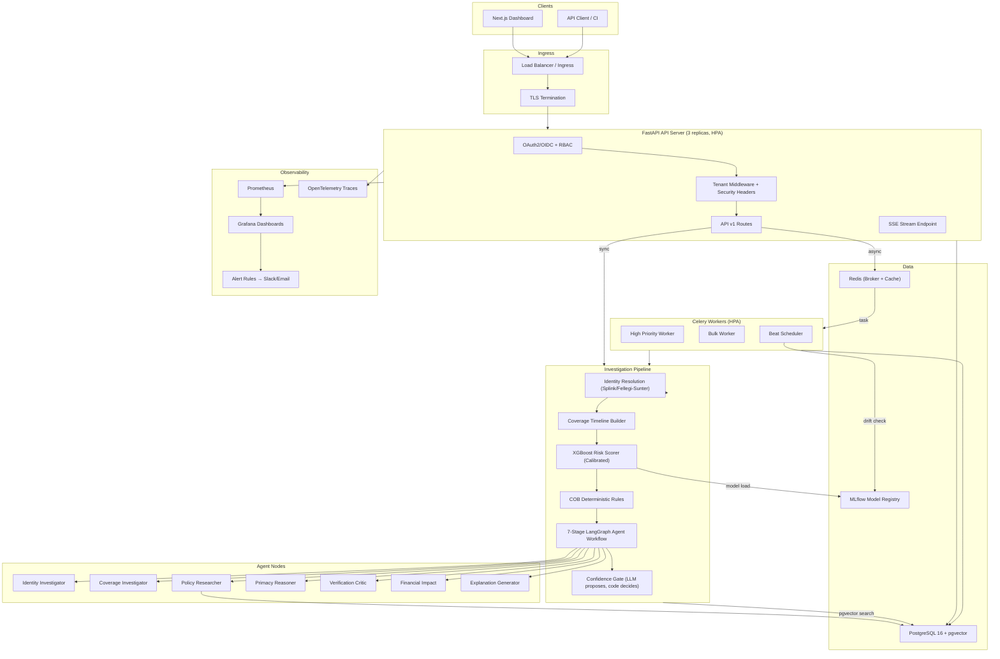
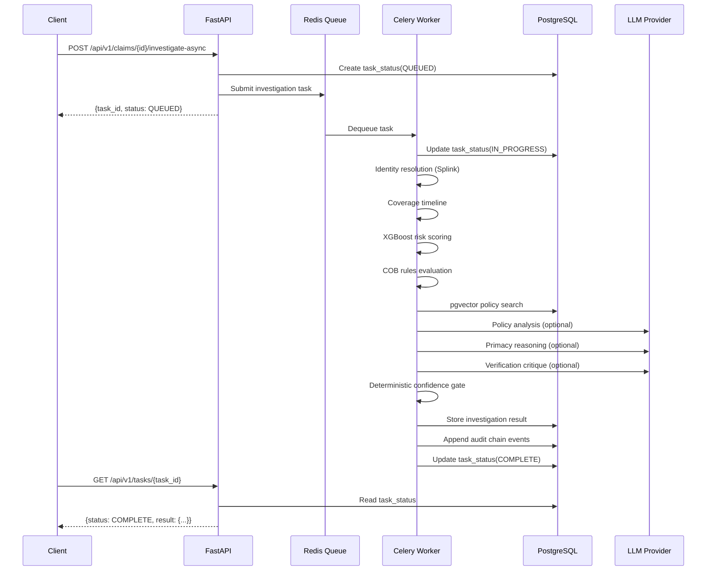

# ClaimArmor AI — Production Architecture

## System Overview

## Key Architecture Decisions

| Decision | Rationale |
|---|---|
| **LLM proposes, deterministic code decides** | Regulatorily defensible — no black-box AI payment decisions |
| **SHA-256 hash-linked audit chain** | Tamper-evident trail meets CMS audit requirements |
| **Celery + Redis async** | Decouple API latency from investigation time; enables bulk processing |
| **pgvector semantic search** | Scales to 100K+ policy documents; better recall than TF-IDF |
| **Multi-tenant via RLS** | Data isolation without separate databases per customer |
| **MLflow model registry** | Versioned model governance with drift detection |
| **HPA on CPU + queue depth** | Auto-scales API and workers independently |

## Production Stack

| Layer | Technology |
|---|---|
| API Server | FastAPI + Uvicorn (4 workers) |
| Database | PostgreSQL 16 + pgvector |
| Cache / Broker | Redis 7 |
| Async Workers | Celery 5.4 |
| ML Pipeline | XGBoost + scikit-learn (calibrated) |
| Entity Resolution | Splink / Fellegi-Sunter |
| Agent Orchestration | LangGraph |
| LLM Providers | Gemini / OpenAI / OpenRouter (optional, offline fallback) |
| Model Registry | MLflow |
| Observability | Prometheus + Grafana + OpenTelemetry |
| Container | Docker (multi-stage, non-root) |
| Orchestration | Kubernetes (Helm chart) |
| CI/CD | GitHub Actions |
| TLS | cert-manager + Let's Encrypt |

## Data Flow

## Security Architecture

- **Authentication**: OAuth2 PKCE + OIDC token introspection (local JWT fallback)
- **Authorization**: Role-based (ANALYST, REVIEWER, AUDITOR, ADMIN) with tenant isolation
- **Transport**: TLS 1.3 mandatory via ingress
- **Headers**: HSTS, CSP, X-Frame-Options, Referrer-Policy, Permissions-Policy
- **Data at rest**: Field-level Fernet encryption for PII (member_name, member_dob)
- **Audit**: SHA-256 hash-linked chain from GENESIS (tamper-evident)
- **Rate limiting**: Sliding window per client IP (Redis-backed in production)
- **Secrets**: Kubernetes Secrets / environment variables (never in code)
