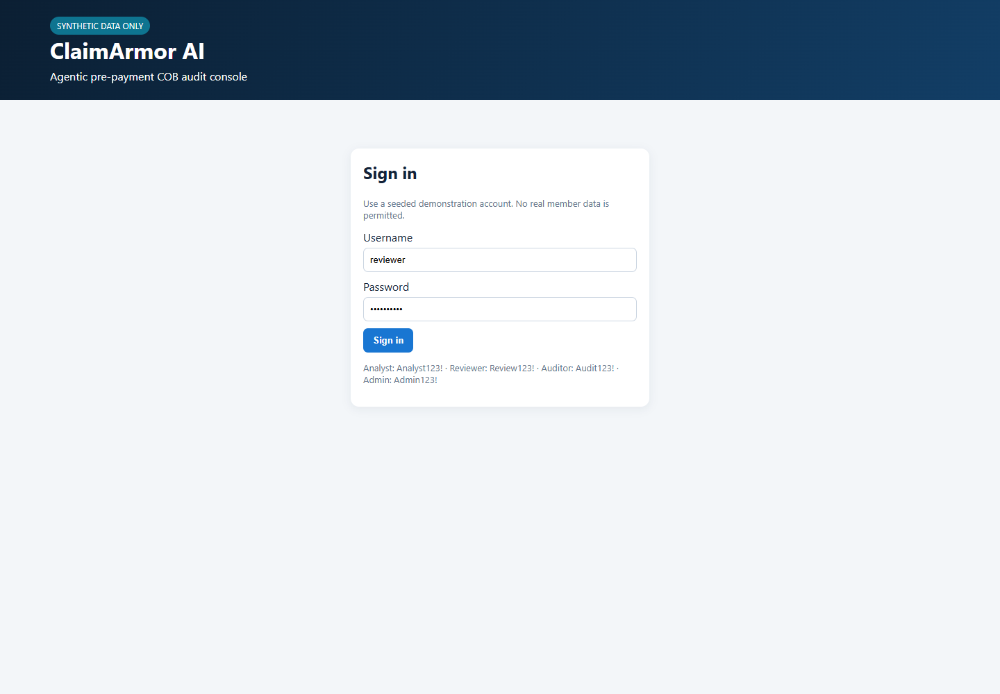
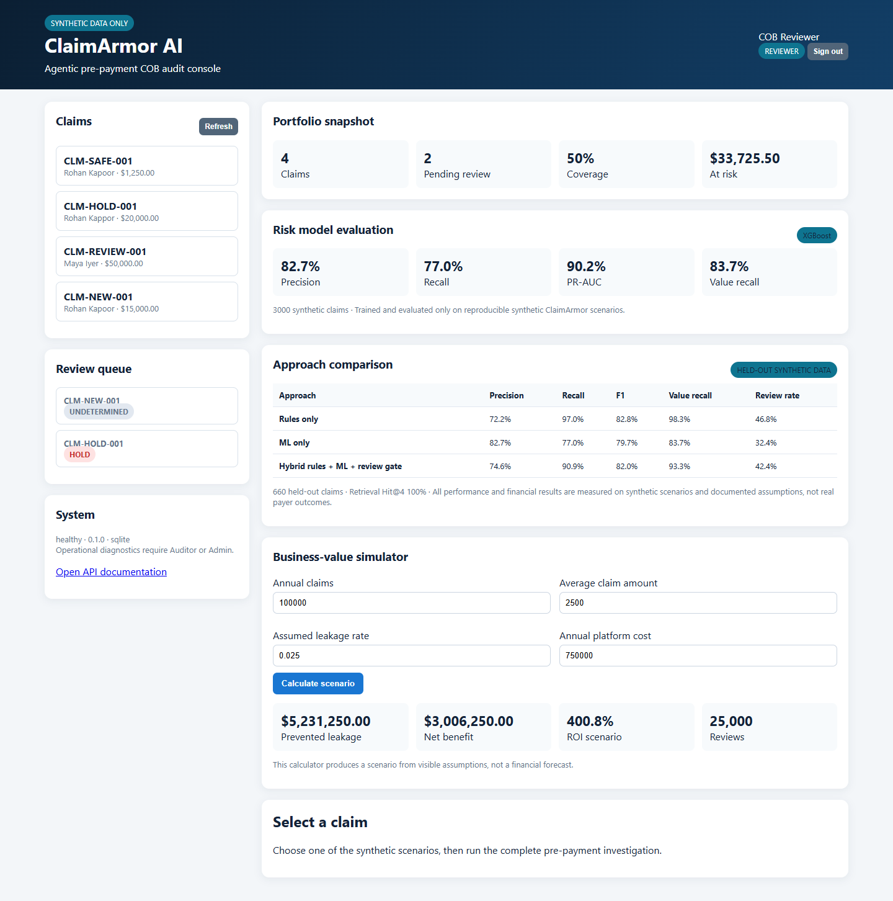
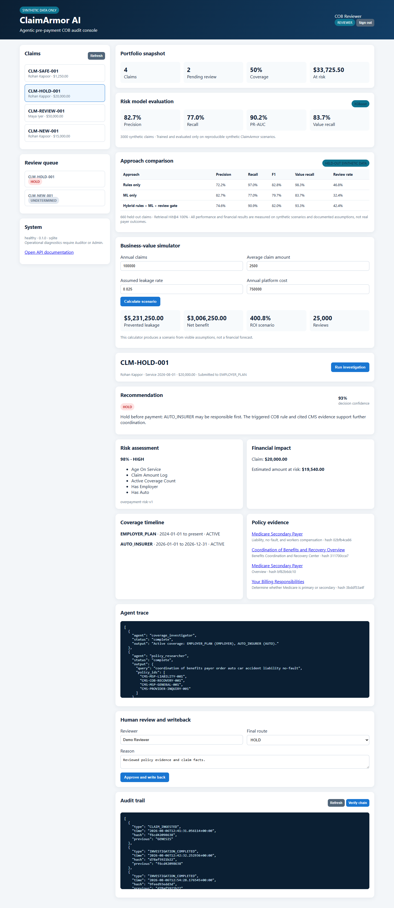

# Real application screenshots

All screenshots below are captured automatically from the locally running
application using `scripts/capture_screenshots.py`. They contain synthetic data.

## Login and data boundary

The first screen establishes the synthetic-only scope and exposes seeded
role-specific demonstration accounts.

## Operations and evidence dashboard

The authenticated dashboard shows the claims portfolio, pending review queue,
held-out model metrics, approach comparison, and assumption-driven ROI tool.

## Claim investigation

The accident scenario demonstrates a real XGBoost prediction, service-date
coverage, deterministic rule, hashed CMS evidence, six-stage LangGraph trace,
human-review controls, and audit history.

