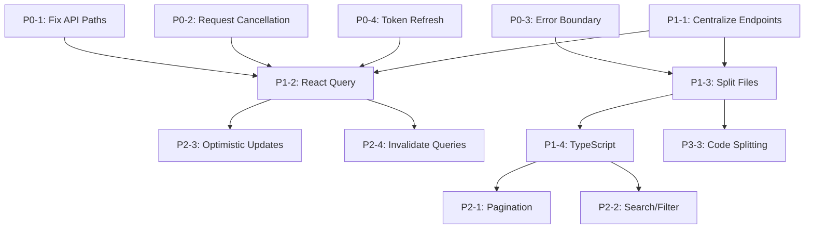

# ClaimArmor AI — Frontend Improvement Plan

**Created:** 2026-08-19  
**Status:** Planning Phase  
**Frontend Stack:** Vite + React 18 + React Router v6 (single-file SPA in `frontend/src/main.jsx`)

---

## Executive Summary

The current frontend is a **single 1,328-line React file** (`main.jsx`) containing 10 pages, shared components, auth context, and API client. While functional, it has critical bugs (API path mismatches), architectural debt (no request cancellation, no error boundaries), and maintainability issues (no TypeScript, no code splitting).

This plan addresses **23 identified issues** across 4 priority tiers.

---

## Priority Matrix

| Tier | Count | Timeline | Focus |
|------|-------|----------|-------|
| **P0 — Critical** | 4 | Week 1 | App-breaking bugs, memory leaks, session management |
| **P1 — High** | 6 | Week 2-3 | Architecture, caching, maintainability |
| **P2 — Medium** | 8 | Week 4-6 | UX, performance, scalability |
| **P3 — Nice-to-Have** | 5 | Future | Accessibility, real-time, developer experience |

---

## P0 — Critical (Week 1)

### P0-1: Fix API Path Mismatches 🔴
**Impact:** Dashboard fails to load (404 on `/api/v1/metrics`, `/api/v1/health`)  
**Root Cause:** Backend routes at `/api/metrics`, `/api/health` (no `/v1` prefix)  
**Files:** `DashboardPage` (lines 176-177), `AnalyticsPage` (line 854), `OpsPage` (line 1133)  
**Fix:** Update all `/api/v1/metrics` → `/api/metrics`, `/api/v1/health` → `/api/health`  
**Effort:** 30 min

### P0-2: Add Request Cancellation (AbortController) 🔴
**Impact:** Memory leaks, state updates on unmounted components, race conditions  
**Root Cause:** `fetch` calls in `useEffect` without cleanup  
**Files:** All 10 pages using `useEffect` + `api()`  
**Fix:** 
1. Add `AbortController` tracking in `AuthProvider.api()`
2. Pass optional `key` param for deduplication
3. Cleanup on unmount
**Effort:** 2 hours

### P0-3: Add Error Boundary 🔴
**Impact:** Uncaught React errors crash entire app (white screen)  
**Root Cause:** No error boundary at app root  
**Files:** New `ErrorBoundary.jsx`, wrap `<AppLayout />` in `App()`  
**Fix:** Class-based error boundary with fallback UI + reload button  
**Effort:** 1 hour

### P0-4: Implement Token Refresh Logic 🔴
**Impact:** Users forcibly logged out when access token expires (no auto-renewal)  
**Root Cause:** `refreshToken` stored but never used  
**Files:** `AuthProvider` (lines 18-19, 41-43)  
**Fix:** 
1. Intercept 401 responses in `api()`
2. Call `/api/v1/auth/refresh` with refresh token
3. Retry original request with new access token
4. Logout on refresh failure
**Effort:** 1.5 hours

---

## P1 — High (Week 2-3)

### P1-1: Centralize API Endpoints 🟠
**Impact:** Magic strings scattered across 10+ components; hard to maintain  
**Root Cause:** No single source of truth for API paths  
**Files:** New `frontend/src/api/endpoints.js`, update all components  
**Fix:** Create endpoint registry with typed functions (see plan appendix)  
**Effort:** 2 hours

### P1-2: Add React Query (TanStack Query) 🟠
**Impact:** Manual caching, deduping, background refetching, stale-while-revalidate  
**Root Cause:** Custom `useEffect` + `useState` patterns throughout  
**Files:** New `queryClient.js`, wrap app in `QueryClientProvider`, refactor all data fetching  
**Fix:** Replace all `useEffect(api(...))` with `useQuery`/`useMutation`  
**Effort:** 4 hours

### P1-3: Split Monolithic `main.jsx` into Multiple Files 🟠
**Impact:** 1,328 lines in one file; violates separation of concerns; hard to review  
**Root Cause:** Single-file SPA pattern  
**Files:** New directory structure:
```
frontend/src/
├── components/     # Shared: MetricCard, Modal, Tabs, StatusDot, etc.
├── pages/          # DashboardPage, ClaimsPage, ClaimDetailPage, etc.
├── hooks/          # useAuth, useApi, usePagination, etc.
├── context/        # AuthContext
├── api/            # endpoints.js, client.js
├── utils/          # formatters (money, pct, shortDate)
├── App.jsx         # Routes + layout
└── main.jsx        # Entry point only
```
**Effort:** 3 hours

### P1-4: Add TypeScript 🟠
**Impact:** No type safety for API responses, props, state; high bug risk  
**Root Cause:** Plain JavaScript  
**Files:** `tsconfig.json`, rename `.jsx` → `.tsx`, add types for all schemas  
**Fix:** Incremental adoption — start with API types from backend schemas  
**Effort:** 6 hours (can be parallelized)

### P1-5: Add Request Deduplication 🟠
**Impact:** Multiple components trigger same `/api/metrics` simultaneously  
**Root Cause:** No request-level deduplication  
**Files:** `AuthProvider.api()` + React Query (P1-2)  
**Fix:** React Query handles this automatically; or custom `key`-based deduping in `api()`  
**Effort:** 1 hour (included in P1-2)

### P1-6: Consistent Error Handling 🟠
**Impact:** Inconsistent UX — some errors show alerts, some toast, some silent  
**Root Cause:** Ad-hoc `setError`/`setNotice` patterns  
**Files:** All pages  
**Fix:** Centralized `useErrorHandler` hook + toast/notification system  
**Effort:** 2 hours

---

## P2 — Medium (Week 4-6)

### P2-1: Implement Pagination for List Pages 🟡
**Impact:** Loads all claims/investigations/reviews at once; OOM risk at scale  
**Root Cause:** Backend supports `limit`/`offset` but frontend ignores it  
**Files:** `ClaimsPage`, `InvestigationsPage`, `ReviewQueuePage`, `PoliciesPage`, `AdminPage`  
**Fix:** Add pagination state + controls + `limit`/`offset` query params  
**Effort:** 3 hours

### P2-2: Add Search & Filtering to Claims/Investigations 🟡
**Impact:** No way to find specific claims; poor UX at scale  
**Root Cause:** Not implemented  
**Files:** `ClaimsPage`, `InvestigationsPage`  
**Fix:** Debounced search input + filter dropdowns (status, route, date range)  
**Effort:** 2 hours

### P2-3: Optimistic Updates for Mutations 🟡
**Impact:** Perceived latency on review actions, claim creation  
**Root Cause:** Wait for server response before updating UI  
**Files:** `ReviewQueuePage` (review actions), `ClaimsPage` (create)  
**Fix:** React Query `onMutate`/`onError`/`onSettled` for optimistic updates  
**Effort:** 2 hours (requires P1-2)

### P2-4: Replace `window.dispatchEvent` with React Query Invalidation 🟡
**Impact:** Fragile cross-component communication; misses updates if tab not mounted  
**Root Cause:** Custom event bus pattern  
**Files:** `ClaimDetailPage`, `InvestigationsPage`, `ReviewQueuePage`, `AppLayout`  
**Fix:** `queryClient.invalidateQueries({ queryKey: ['review-queue'] })` after mutations  
**Effort:** 1 hour (requires P1-2)

### P2-5: Proper Loading Skeletons per Page 🟡
**Impact:** Inconsistent loading states — some show skeleton, some show nothing  
**Root Cause:** Ad-hoc `if (!data) return <Skeleton />`  
**Files:** All pages  
**Fix:** Page-specific skeletons matching content structure  
**Effort:** 2 hours

### P2-6: Add Request Timeouts 🟡
**Impact:** Hanging requests block UI indefinitely  
**Root Cause:** `fetch` has no default timeout  
**Files:** `AuthProvider.api()`  
**Fix:** `AbortSignal.timeout(30000)` or custom timeout wrapper  
**Effort:** 30 min

### P2-7: Remove Hardcoded Demo Credentials 🟡
**Impact:** Security risk if deployed; poor UX for real users  
**Root Cause:** `defaultValue="analyst"` / `defaultValue="Analyst123!"` in `LoginPage`  
**Files:** `LoginPage` (lines 148, 152)  
**Fix:** Remove `defaultValue`, use `placeholder` only; optionally load from env in dev  
**Effort:** 15 min

### P2-8: Consistent Date Formatting 🟡
**Impact:** Mixed date formats across pages  
**Root Cause:** `shortDate` used inconsistently  
**Files:** All pages displaying dates  
**Fix:** Centralize in `utils/formatters.ts`; enforce via linting  
**Effort:** 30 min

---

## P3 — Nice-to-Have (Future)

### P3-1: Full Accessibility Audit 🟢
**Scope:** ARIA labels, roles, keyboard navigation, focus management, color contrast  
**Priority Pages:** Modal, Review modal, Tables, Forms  
**Effort:** 4 hours

### P3-2: Real-time Updates via WebSocket/SSE 🟢
**Scope:** Replace polling for review queue badge, investigation status  
**Backend:** Add SSE endpoint or WebSocket support  
**Effort:** 8 hours (requires backend changes)

### P3-3: Code Splitting & Lazy Loading 🟢
**Scope:** `React.lazy` + `Suspense` for each page route  
**Benefit:** Reduce initial bundle size (~200KB → ~50KB initial)  
**Effort:** 1 hour (after P1-3)

### P3-4: Storybook for Component Documentation 🟢
**Scope:** Document shared components (MetricCard, Modal, Tabs, etc.)  
**Effort:** 3 hours

### P3-5: E2E Test Coverage Expansion 🟢
**Scope:** Playwright tests for critical flows (login → create claim → investigate → review)  
**Current:** `tests/test_e2e_components.py` has basic smoke tests  
**Effort:** 4 hours

---

## Dependency Graph



---

## Recommended Execution Order

| Week | Tasks | Deliverable |
|------|-------|-------------|
| 1 | P0-1, P0-2, P0-3, P0-4 | Stable, non-crashing app with working auth |
| 2 | P1-1, P1-3 | Modular codebase with centralized API |
| 3 | P1-2, P1-4 (start) | React Query + TypeScript foundation |
| 4 | P1-4 (complete), P1-5, P1-6 | Full TypeScript + consistent errors |
| 5 | P2-1, P2-2, P2-6, P2-7, P2-8 | Paginated, searchable lists + polish |
| 6 | P2-3, P2-4, P2-5 | Optimistic updates + real-time feel |
| Future | P3-1 through P3-5 | Accessibility, real-time, docs, tests |

---

## Appendix: API Endpoint Registry Design

```typescript
// frontend/src/api/endpoints.ts
export const API_ENDPOINTS = {
  auth: {
    login: () => '/api/v1/auth/login',
    me: () => '/api/v1/auth/me',
    refresh: () => '/api/v1/auth/refresh',
  },
  claims: {
    list: (params?: { limit?: number; offset?: number }) => 
      `/api/v1/claims${params ? '?' + new URLSearchParams(params).toString() : ''}`,
    create: () => '/api/v1/claims',
    detail: (id: string) => `/api/v1/claims/${id}`,
    investigate: (id: string) => `/api/v1/claims/${id}/investigate`,
    investigateAsync: (id: string) => `/api/v1/claims/${id}/investigate-async`,
    investigateStream: (id: string) => `/api/v1/claims/${id}/investigate-stream`,
    replay: (id: string) => `/api/v1/claims/${id}/replay`,
    uploadCsv: () => '/api/v1/claims/upload-csv',
    uploadEdi: () => '/api/v1/claims/upload-edi',
  },
  investigations: {
    list: (params?: { limit?: number; offset?: number }) =>
      `/api/v1/investigations${params ? '?' + new URLSearchParams(params).toString() : ''}`,
    reviewQueue: (params?: { limit?: number; offset?: number }) =>
      `/api/v1/review-queue${params ? '?' + new URLSearchParams(params).toString() : ''}`,
    completedReviews: (params?: { limit?: number; offset?: number }) =>
      `/api/v1/reviews/completed${params ? '?' + new URLSearchParams(params).toString() : ''}`,
    review: (id: string) => `/api/v1/investigations/${id}/review`,
  },
  tasks: {
    status: (id: string) => `/api/v1/tasks/${id}`,
  },
  audit: {
    trail: (id: string) => `/api/v1/audit/${id}`,
    verify: (id: string) => `/api/v1/audit/${id}/verify`,
  },
  policies: {
    list: () => '/api/v1/policies',
  },
  analytics: {
    metrics: () => '/api/metrics',           // NOTE: no /v1 prefix
    modelMetrics: () => '/api/v1/model/metrics',
    evaluation: () => '/api/v1/evaluation',
    retrieval: () => '/api/v1/retrieval/metrics',
    roi: () => '/api/v1/business/roi',
  },
  ops: {
    status: () => '/api/v1/ops',
  },
  admin: {
    users: () => '/api/v1/admin/users',
    userDeactivate: (username: string) => `/api/v1/admin/users/${username}/deactivate`,
    llmUsage: () => '/api/v1/admin/llm-usage',
  },
  health: () => '/api/health',               // NOTE: no /v1 prefix
} as const;
```

---

## Appendix: React Query Migration Pattern

```typescript
// Before (current pattern)
function ClaimsPage() {
  const [claims, setClaims] = useState([]);
  const [error, setError] = useState('');
  
  useEffect(() => {
    api('/api/v1/claims').then(setClaims).catch(e => setError(e.message));
  }, []);
  
  // ...
}

// After (with React Query)
function ClaimsPage() {
  const { data: claims = [], isLoading, error, refetch } = useQuery({
    queryKey: ['claims', { limit: 50, offset: 0 }],
    queryFn: () => apiClient.get(API_ENDPOINTS.claims.list({ limit: 50, offset: 0 })),
  });
  
  const createMutation = useMutation({
    mutationFn: (payload) => apiClient.post(API_ENDPOINTS.claims.create(), payload),
    onSuccess: () => queryClient.invalidateQueries({ queryKey: ['claims'] }),
  });
  
  // ...
}
```

---

## Risk Assessment

| Risk | Likelihood | Impact | Mitigation |
|------|------------|--------|------------|
| P0 fixes reveal more bugs | High | Medium | Budget 20% buffer in Week 1 |
| TypeScript migration breaks build | Medium | High | Incremental adoption; `any` allowed temporarily |
| React Query learning curve | Medium | Low | Pair programming; use existing patterns |
| Backend API changes during refactor | Low | High | Freeze backend API during frontend sprint |
| Bundle size increases with TypeScript | Low | Low | Code splitting (P3-3) offsets this |

---

## Success Metrics

| Metric | Current | Target |
|--------|---------|--------|
| Dashboard load errors | 2 (404s) | 0 |
| Memory leaks (devtools) | Yes | No |
| Uncaught error crashes | Possible | Impossible (error boundary) |
| Token expiry handling | Manual logout | Auto-refresh |
| Files > 500 lines | 1 (main.jsx) | 0 |
| TypeScript coverage | 0% | 80%+ |
| Request deduplication | None | Full (React Query) |
| Pagination on list pages | 0/5 pages | 5/5 pages |
| Test coverage (E2E) | Smoke only | Critical flows |

---

## Next Steps

1. **Review & approve** this plan
2. **Assign owners** for each P0 task
3. **Create GitHub issues** for each task with acceptance criteria
4. **Set up branch strategy**: `feat/p0-*`, `feat/p1-*`, etc.
5. **Begin Week 1 sprint** with P0 tasks